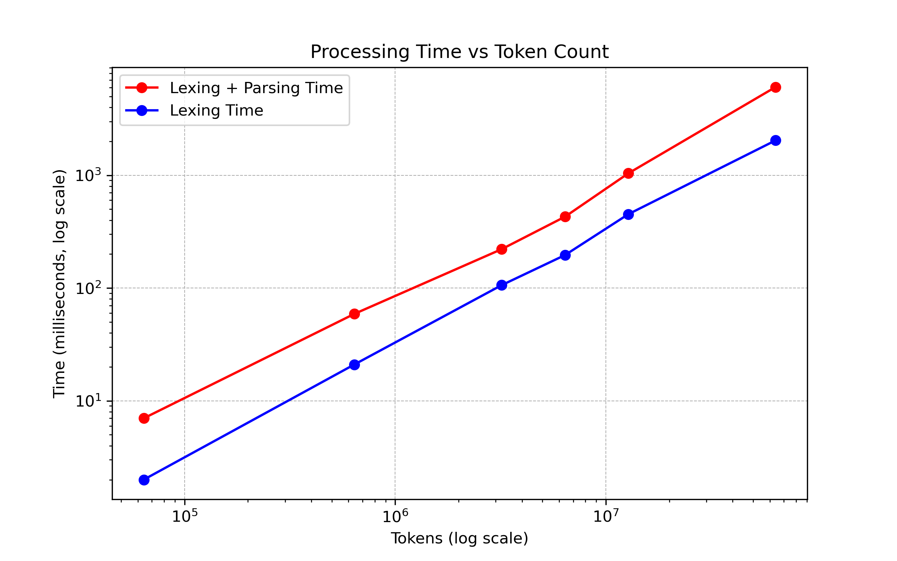

# pasro-tangue-syntactic-analyzer

Синтаксический анализатор для языка программирования PasroTangue

## Язык PasroTangue

ParsoTangue – простой язык программирования, который позволяет делать простые расчёты с
целыми числами и строками.

Поддерживаемые конструкции:

- Объявление переменной фиксированного типа
- Арифметические операции: сложение `+`, вычитание `-`, умножение `*`, деление `/`, деление с остатком `%`, унарный
  минус `-`
- Строковые литералы в двойных кавычках
- Операции сравнения: `<=`, `>=`, `<`, `>`, `==`, `!=`
- Объявление функций (с возвращаемым значением и без)
- Условные операторы

Описание грамматики языка находится в файле `/src/main/resources/grammar.bnf`.

### Пример кода на языке PasroTangue

```PasroTangue
fun main() {
    // Variable declaration and assignment
    int x;
    int y = 2;
    x = y + 3;
    
    // Arithmetic operations with parentheses
    x = -x + 2 / 1 - 3 * (14 % 5);
    
    // String literals in double quotes
    str s = "Hello, world!";
    
    // Function call
    println(s);
    
    // Function call with arguments
    x = min(2, 3) + 12;

    // If-else statements:
    if (x < y) {
        // Number of whitespaces between tokens doesn't matter
        println(-1 +   x *2 
            + y*3   -4);
    } else {
        println("x is greater than or equal to y");
    }
    
    if (x == 2) {
        println("x is 2");
    }
}

// Function declaration
fun min(a: int, b: int) : int {
    if (a < b) {
        return a;
    } else {
        return b;
    }
}
```

## Синтаксический анализатор

Реализованы лексер и парсер для данного языка.
Программа принимает в качестве аргументов путь к файлу с кодом и опциональный аргумент – путь файла, следующий за флагом
`-o`, в который надо записать полученное дерево. (По умолчанию выводится в консоль)

Если аргументы не указаны, то программа парсит файлы примеров из директории
`./src/main/resources/` и выводит абстрактное синтаксическое дерево в консоль.

В файлах `lexer_error.pt` и `parser_error.pt` допущены ошибки в синтаксисе языка, и информация о них также выведется в
консоль.

Файл `benchmark.pt` на полмиллиона строк парсится за полсекунды, хотя полученное в результате дерево записывается в файл
ощутимо дольше.

### Алгоритм работы

Для парсера используется алгоритм рекурсивного спуска.
При этом для выражений и бинарных операторов реализован алгоритм парсинга Пратта.

Лексер представляет собой подобие конечного автомата, в котором за состояния отвечают функции.

### Анализ реализации

Изначально в прототипе лексер был реализован на основе регулярных выражений, в дальнейшем был переписан для увеличения
производительности.

Также интерфейс лексера был изменен и теперь он возвращает не `List<Token>`, а `Sequence<Token>`, разбирая текст на
токены лениво. Это позволяет ускорить его работу на больших файлах до двух раз, за счет избавления от аллокаций памяти
для увеличивающегося списка токенов.

Сейчас скорость работы лексера и парсера на больших файлах примерно совпадают.
Также по графику видно, что скорость на файлах большого размера становится лучше


| Number of tokens | Lexing time, ms | Lexing + Parsing time, ms |
|------------------|-----------------|---------------------------|
| 64 * 1e3         | 2               | 7                         |
| 64 * 1e4         | 21              | 59                        |
| 64 * 5e4         | 106             | 221                       |
| 64 * 1e5         | 196             | 429                       |
| 64 * 2e5         | 452             | 1041                      |
| 64 * 1e6         | 2039            | 6062                      |

Улучшить производительность можно распараллелив процесс разбиения кода на токены и заменив `when`-конструкции на
таблицы переходов между состояниями. 
